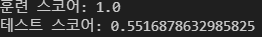
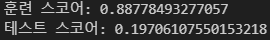

# [SKN09-2nd-2Team]
✅ SKN AI FAMILY CAMP 9기 

---
# 💗Contents

| 1. 팀 소개 | 2. 프로젝트 개요 | 3. 데이터 소개 | 4. ML 절차 | 5.기대효과 |
|------------|----------------|----------------|------------|------------|
| 팀명 | 프로젝트 기간, WBS | 데이터 소개, 사용 컬럼 소개 | 데이터 정제, 이상치,결측치 처리, EDA | 기대효과 및 결론 |
|팀원 소개 | 프로젝트 주제, 진행배경 | info | 데이터 전처리, 모델 선정 | |
| | | | 평가, 피드백 | | 

---

# 💗Team Introduce
### 🎃팀명: Fade Out 🍀 
### 🐱팀원

| 이름      | GitHub ID                          |
|-----------|------------------------------------|
| 🧑‍💻 김우중  | [@kwj9942](https://github.com/kwj9942)      |
| 👩‍💻 이다인  | [@daainn](https://github.com/daainn)        |
| 👩‍💻 이재혁  | [@ohdyo](https://github.com/ohdyo)          |
| 👨‍💻 전성원  | [@Hack012](https://github.com/Hack012)      |

 

---

# 💗Project Overview
✅ **프로젝트 기간: 2025.02.04 - 2025. 02.14**
## WBS
- 이미지 들어갈 예정

## 프로젝트 주제
#### **음악 사이트 이탈률 분석**

## 프로젝트 진행 배경

모바일 음악 스트리밍 시장의 경쟁이 치열해지면서, AI 기반 추천 시스템과 독점 콘텐츠 확보가 핵심 전략으로 부상함  
`Spotify`, `Apple Music` 등은 AI 알고리즘을 활용한 맞춤형 추천과 큐레이션 기능을 강화하며 사용자를 확보하고 있으며, `멜론`, `지니뮤직`, `플로` 등도 유사한 전략을 통해 경쟁력을 높임
이러한 환경에서 **사용자 이탈**을 **예측**하고 **방지**하는 것은 음악 앱의 생존과 직결되는 핵심 요소가 되었음

# 💗 Dataset Description
## 데이터 소개
- <a href="https://www.kaggle.com/competitions/kkbox-churn-prediction-challenge/data">대만 음원 사이트KKBox</a>
## 사용 컬럼 소개

### 원본 데이터
`train.csv`
>*사용자의 이탈 여부를 확인할 수 있는 데이터*
- **msno**: 사용자 고유 식별자
- **is_churn**: 이탈 여부 (1: 이탈, 0: 유지)

`members.csv`
>*사용자 특성 데이터*
- **msno**: 사용자 고유 식별자
- **city**: 사용자의 도시 코드
- **bd**: 사용자의 연령
- **gender**: 사용자의 성별 (남성/여성/미입력)
- **registered_via**: 사용자의 등록 경로 (예: Facebook, Google 등)
- **registration_init_time**: 사용자의 최초 가입 날짜

`transactions.csv`
>*사용자 거래 기록 데이터*
- **msno**: 사용자 고유 식별자
- **payment_plan_id** : 지불 방법
- **payment_plan_days** : 멤버심 플랜 기간 (일)
- **plan_list_price** : 요금제 가격
- **actual_amount_paid** : 실제 지불한 가격
- **is_auto_renew** : 자동갱신 여부
- **transaction_date** : 구독 거래 날짜
- **membership_expire_date** : 구독 만료 날짜
- **is_
- **is_cancel**: 구독 취소 여부

`user_logs.csv`
>*사용자 플랫폼 사용 특성 데이터*
- **msno**: 사용자 고유 식별자
- **날짜**: 노래를 청취한 날짜(로그에 기록된 날짜)
- **num_25**: 전체 노래 길이 중 25% 이하로 청취된 곡 수
- **num_50**: 전체 노래 길이 중 50% 이하로 청취된 곡 수
- **num_75**: 전체 노래 길이 중 75% 이하로 청취된 곡 수
- **num_985**: 전체 노래 길이 중 98.5% 이하로 청취된 곡 수
- **num_100**: 전체 노래 길이 중 100% 청취된 곡 수
- **num_unq**: 고유한 곡 청취 수
- **total_secs**: 총 청취 시간(초)

### 최종 데이터

`final_data.csv`
- **city**: 사용자의 도시 코드
- **bd**: 사용자의 연령
- **gender**: 사용자의 성별 (남성/여성/미입력)
- **registered_via**: 사용자의 등록 경로 (예: Facebook, Google 등)
- **is_churn**: 이탈 여부 (1: 이탈, 0: 유지)
 **payment_plan_sum**: 사용자가 구독한 결제 플랜 개수
**plan_list_price**: 구독 요금제 원가 합
- **actual_amount_paid**: 실제 결제된 금액 합
- **discount_rate**: 구독 요금제 원가와 실제 결제된 금액을 토대로 계산된 할인율
- **is_auto_renew** : 자동갱신 여부 비율
- **is_cancel**: 구독 취소 여부 비율
- **transaction_count**: 총 거래 횟수
- **num_25**: 전체 노래 길이 중 25% 이하로 청취된 곡 수
- **num_50**: 전체 노래 길이 중 50% 이하로 청취된 곡 수
- **num_75**: 전체 노래 길이 중 75% 이하로 청취된 곡 수
- **num_985**: 전체 노래 길이 중 98.5% 이하로 청취된 곡 수
- **num_100**: 전체 노래 길이 중 100% 청취된 곡 수
- **num_unq**: 고유한 곡 청취 수
- **total_secs**: 총 청취 시간(초)
- **registration_duration**: 총 가입 기간
- **listening_duration**:
총 노래 청취 기간
- **is_back**: 사용자가 다시 돌아왔는지 여부

# Tech Stack

| **분야** |**사용 프로그램**|**데이터 처리**|**모델 학습**|**기타**|
|:---:|:---:|:---:|:---:|:---:|
|**기술** ||      |&nbsp;   &nbsp;|&nbsp;|

# 💗 데이터 전처리 결과서 (EDA)

## 데이터 정제 및 파생변수 생성
사용자를 식별하는  `MSNO`컬럼값이 `Rb9UwLQTrxzBVwCB6+bCcSQWZ9JiNLC9dXtM1oEsZA8=`와 같이 매우 길게 구성되어 있어 데이터의 크기를 불필요하게 증가시키는 문제가 있었다. 이를 해결하기 위해 각 값을 고유한 숫자로 변환하는 인코딩을 적용하여 데이터의 효율성을 높였다.

#### 거래 데이터
*

#### 로그 데이터

타 데이터와 로그 데이터를 합치는 과정에서 로그 데이터에만 존재하는 `msno`는 드롭해주었다.

## 데이터 이상치 및 결측치 처리
- 이상치 탐색 후 제거

|  |  |
|:------------:|:---------------:|

- 결측치 대체 시도

| **성별 변수 분류** | **연령 변수 회귀** |
|:------------:|:---------------:|
|  |  ||:------------:|:---------------:|

- 나머지 변수들이 성별과 나이를 설명할 수 없어 결측치 대체에 실패하여 결측치를 전부 제거

## EDA

## 데이터 전처리
- 라벨 인코딩(성별) 

- 정규화

# 인공지능 학습 결과서 

## 모델 선정 및 학습
- 모델선정은 그리드 서치를 이용하여 최적 파리미터를 선택하였고 StratifiedKFold의 평균값으로 선정한다.

- 의사결정나무

| **Score** | **혼동 행렬** | **ROC Curve** | 
|:----------------:|:------------:|:------------:|
|정확도: 0.876   정밀도: 0.693   재현율: 0.530|  |  |

- 의사결정나무 오버샘플링

| **Score** | **혼동 행렬** | **ROC Curve** |
|:----------------:|:------------:|:------------:|
|정확도: 0.942   정밀도: 0.899   재현율: 0.997|  |  |

- 랜덤포레스트

| **Score** | **혼동 행렬** | **ROC Curve** |
|:----------------:|:------------:|:------------:|
|정확도: 0.978   정밀도: 0.951   재현율: 0.909|  |  |

- 랜덤포레스트 오버샘플링

| **Score** | **혼동 행렬** | **ROC Curve** |
|:----------------:|:------------:|:------------:|
|정확도: 0.992   정밀도: 0.987   재현율: 0.998|  |  |

- XGBoost

| **Score** | **혼동 행렬** | **ROC Curve** |
|:----------------:|:------------:|:------------:|
|정확도: 0.   정밀도: 0.   재현율: 0.|  |  |

- XGBoost 오버샘플링

| **Score** | **혼동 행렬** | **ROC Curve** |
|:----------------:|:------------:|:------------:|
|정확도: 0.   정밀도: 0.   재현율: 0.|  |  |

- LightGBM

| **Score** | **혼동 행렬** | **ROC Curve** |
|:----------------:|:------------:|:------------:|
|정확도: 0.   정밀도: 0.   재현율: 0.|  |  |

- LightGBM 오버샘플링

| **Score** | **혼동 행렬** | **ROC Curve** |
|:----------------:|:------------:|:------------:|
|정확도: 0.680   정밀도: 0.747   재현율: 0.536|  |  |

## 최종 모델 선정

- 랜덤포레스트 최종 모델 선정

| **의사결정나무** | **랜덤 포레스트** | **XGBoost** | **LightGBM** |
|:------------:|:------------:|:------------:|:------------:|
| 정확도: 0.942   정밀도: 0.899   재현율: 0.997 | 정확도: 0.992   정밀도: 0.987   재현율: 0.998 |  | 정확도: 0.680   정밀도: 0.747   재현율: 0.536 |

- 높은 정확도 확인

- 클러스터링을 통해 모델의 높은 정확도가 이상값이 아닌 잘 정제된 데이터에 의한 것임을 확인

# 수행 결과

## Streamlit

## Expected Outcomes
- 본 프로젝트를 통해 **음악 사이트의 이탈 요인을 보다 명확하게 이해**하고, 이를 기반으로 맞춤형 마케팅 및 운영 전략을 수립할 수 있다.
- **이탈 예측 모델을 활용하여 사전 대응 전략을 강화**하고, 궁극적으로 사용자 유지율을 높이는 데 도움을 줄수 있다.

# 한 줄 회고

- 김우중 : 
- 이다인 : 
- 이재혁 : 
- 전성원 : 
