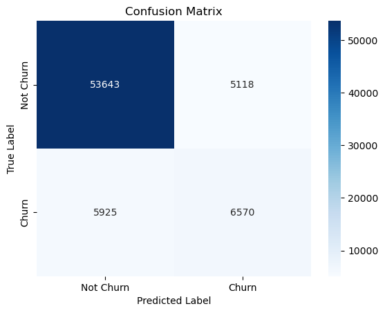
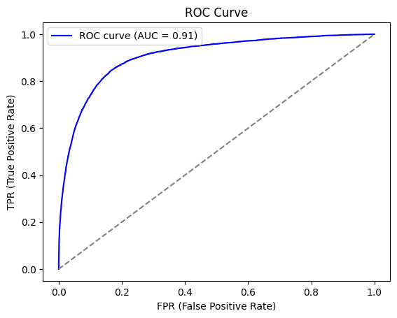
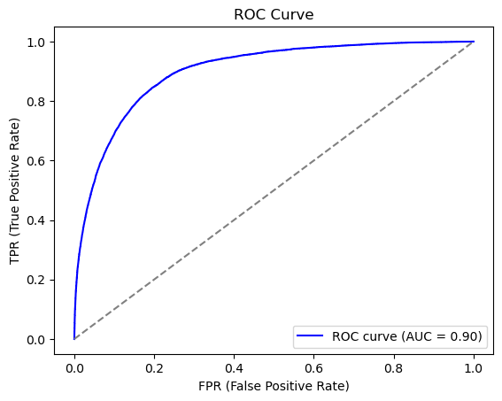

# [SKN09-2nd-2Team]
✅ SKN AI FAMILY CAMP 9기<br>

<div align="center">
  
</div>


---
# 🔊Contents

1. **팀 소개**
   - 팀명
   - 팀원 소개

2. **프로젝트 개요**
   - 프로젝트 소개
   - 프로젝트 필요성
   - 프로젝트 목표
   - 데이터 소개

3. **기술 스택**

4. **작업 분담 (WBS)**

5. **탐색적 데이터 분석 (EDA)**
   - 데이터 전처리 수행과정
   - EDA 인사이트 및 주요 패턴

6. **머신러닝 학습 결과**
   - 선택 모델 및 성능 비교
   - 모델 결과 시각화
   - 특성 중요도 분석

7. **결론**
   - 데모 시스템 구현
   - 향후 과제

8. **한 줄 회고**


---

# 🎙️Team Introduce
### 🎃팀명: StayTuned 🍀<br>
### 🐱팀원


| 김우중 | 이다인 | 이재혁 | 전성원 |
|------|------|------|------|
|  |  |  |  |
| [@kwj9942](https://github.com/kwj9942) | [@daainn](https://github.com/daainn) | [@ohdyo](https://github.com/ohdyo) | [@Hack012](https://github.com/Hack012) |

---

# 🎼Project Overview
✅ **프로젝트 기간: 2025.02.04 - 2025. 02.14**

## 1. 프로젝트 주제
#### 🎤**음악 사이트 이탈률 분석**

## 2. 프로젝트 소개
#### 프로젝트 필요성

모바일 음악 스트리밍 시장의 경쟁이 치열해지면서, AI 기반 추천 시스템과 독점 콘텐츠 확보가 핵심 전략으로 부상하였다. 
`Spotify`, `Apple Music` 등은 AI 알고리즘을 활용한 맞춤형 추천과 큐레이션 기능을 강화하며 사용자를 확보하고 있으며, `멜론`, `지니뮤직`, `플로` 등도 유사한 전략을 통해 경쟁력을 높이고 있다.
이러한 환경에서 **사용자 이탈**을 **예측**하고 **방지**하는 것은 음악 앱의 생존과 직결되는 핵심 요소가 되었다.

#### 프로젝트 목표
블라블라

## 3. 데이터 소개

- <a href="https://www.kaggle.com/competitions/kkbox-churn-prediction-challenge/data">대만 음원 사이트KKBox</a>

#### 원본 데이터
`train.csv`
>*사용자의 이탈 여부를 확인할 수 있는 데이터*
- **msno**: 사용자 고유 식별자
- **is_churn**: 이탈 여부 (1: 이탈, 0: 유지)

`members.csv`
> *사용자의 고유 특성과 관련된 데이터*
- **msno**: 사용자 고유 식별자
- **city**: 사용자의 도시 코드
- **bd**: 사용자의 연령
- **gender**: 사용자의 성별 (남성/여성/미입력)
- **registered_via**: 사용자의 등록 경로 (예: Facebook, Google 등)
- **registration_init_time**: 사용자의 최초 가입 날짜


`transactions.csv`

>*사용자 거래 기록 데이터*
- **msno**: 사용자 고유 식별자
- **payment_plan_id** : 지불 방법
- **payment_plan_days** : 멤버심 플랜 기간 (일)
- **plan_list_price** : 요금제 가격
- **actual_amount_paid** : 실제 지불한 가격
- **is_auto_renew** : 자동갱신 여부
- **transaction_date** : 구독 거래 날짜
- **membership_expire_date** : 구독 만료 날짜
- **is_cancel**: 구독 취소 여부

`user_logs.csv`
>*사용자 플랫폼 사용 특성 데이터*
- **msno**: 사용자 고유 식별자
- **날짜**: 노래를 청취한 날짜(로그에 기록된 날짜)
- **num_25**: 전체 노래 길이 중 25% 이하로 청취된 곡 수
- **num_50**: 전체 노래 길이 중 50% 이하로 청취된 곡 수
- **num_75**: 전체 노래 길이 중 75% 이하로 청취된 곡 수
- **num_985**: 전체 노래 길이 중 98.5% 이하로 청취된 곡 수
- **num_100**: 전체 노래 길이 중 100% 청취된 곡 수
- **num_unq**: 고유한 곡 청취 수
- **total_secs**: 총 청취 시간(초)

#### 최종 데이터

`final_data.csv`
> *데이터 정제 및 파생변수 생성을 마친 최종 데이터*
- **city**: 사용자의 도시 코드
- **bd**: 사용자의 연령
- **gender**: 사용자의 성별 (남성/여성/미입력)
- **registered_via**: 사용자의 등록 경로 (예: Facebook, Google 등)
- **is_churn**: 이탈 여부 (1: 이탈, 0: 유지)
 **payment_plan_sum**: 사용자가 구독한 결제 플랜 개수
**plan_list_price**: 구독 요금제 원가 합
- **actual_amount_paid**: 실제 결제된 금액 합
- **discount_rate**: 구독 요금제 원가와 실제 결제된 금액을 토대로 계산된 할인율
- **is_auto_renew** : 자동갱신 여부 비율
- **is_cancel**: 구독 취소 여부 비율
- **transaction_count**: 총 거래 횟수
- **num_25**: 전체 노래 길이 중 25% 이하로 청취된 곡 수
- **num_50**: 전체 노래 길이 중 50% 이하로 청취된 곡 수
- **num_75**: 전체 노래 길이 중 75% 이하로 청취된 곡 수
- **num_985**: 전체 노래 길이 중 98.5% 이하로 청취된 곡 수
- **num_100**: 전체 노래 길이 중 100% 청취된 곡 수
- **num_unq**: 고유한 곡 청취 수
- **total_secs**: 총 청취 시간(초)
- **registration_duration**: 총 가입 기간
- **listening_duration**:
총 노래 청취 기간
- **is_back**: 사용자가 다시 돌아왔는지 여부

# 🎧Tech Stack
<center>

| **분야** |**사용 프로그램**|**데이터 처리**|**모델 학습**|**기타**|
|:---:|:---:|:---:|:---:|:---:|
|**기술** || <br>  <br> |&nbsp; <br> &nbsp;|&nbsp;|
</center>

# 🎼WBS


# 🥁 탐색적 데이터 분석 (EDA)

## 1. 데이터 전처리 수행과정
###  데이터 정제 및 파생변수 생성
> 사용자를 식별하는  `MSNO`컬럼값이 `Rb9UwLQTrxzBVwCB6+bCcSQWZ9JiNLC9dXtM1oEsZA8=`와 같이 매우 길게 구성되어 있어 데이터의 크기를 불필요하게 증가시키는 문제가 있었다. 이를 해결하기 위해 각 값을 고유한 숫자로 변환하는 인코딩을 적용하여 데이터의 효율성을 높였다.

#### 거래 데이터
> 음원 스트리밍 서비스에서 사용자가 구독을 종료한 후 다시 재구독하면, 하나의 사용자에 대해 여러 개의 거래 데이터가 기록될 수 있다. 이를 해결하기 위해, 사용자별로 하나의 행만 유지하도록 데이터를 재구성하였다.
* `is_back` : 사용자가 재구독을 한 경우 1의 값, 사용자가 재구독을 하지 않았을 경우 0의 값을 가지도록 구성.
* `payment_plan_sum` : 사용자가 구독한 결제 플랜 개수의 총함.
* `plan_list_price` : 사용자가 구매한 요금제 가격의 총합.
* `actual_amount_paid ` : 사용자가 실제 지불한 금액의 총합.
* `discount_rate` : 구독한 결제 플랜과 구매한 요금제 가격을 통해 계산된 할인율의 평균.
* `is_auto_renew` : 자동갱신여부의 비율.
* `is_cancle` : 구독 만료 여부의 비율.
* `membership_expire_date` : 가장 최근 구독 만료 날짜.
* `transaction_count` : 총 거래 횟수.

#### 로그 데이터

* 로그 데이터의 경우 파일의 크기가 다른 파일에 비해 공간을 많이 차지하기에 파일을 판다스가 읽을수 있는 크기로 분할

* `member.csv`에 없는 `msno` 드랍

* 모든 데이터가 사용 횟수 및 갯수에 대한 컬럼이기에 음수가 존재하면 안된다 판단하여 음수값이 들어간 행 드랍

* msno별 누적 횟수를 파악하도록 값을 누적시켜 압축
    * 최종적으로 고유한 유저 마다 이용별 기록 횟수 확인 가능 


>* 데이터 정제 및 파생변수 생성을 마친 후 거래 데이터와 로그 데이터 및 타 데이터를 `msno`를 기준으로 merge하여 `Final_Data.csv`데이터 생성.
> * 이 과정에서 로그 데이터에만 존재하는 `msno`는 드롭해주었다.

#### `Final_Data.csv` 데이터 정제

1. 불필요한 컬럼 삭제
    - `msno`, `membership_expire_date`, `registration_init_time`, `log_start`, `log_end`
    - `is_back`(모델 학습 시 drop)
2. `int`형을 `datetime`으로 변환후 기간 파생변수 생성

   - 등록 기간(일수) 파생변수 생성: 
   ```python
   df['registration_duration'] = (df['membership_expire_date'] - df['registration_init_time']).dt.days
   ```
   - 음악 청취 기간(일수) 파생변수 생성: 
   ```python
   df['listening_duration'] = (df['log_end'] - df['log_start']).dt.days
   ```

### 데이터 이상치 및 결측치 처리

- 결측치 대체 시도 : 성별과 연령 변수에 null값과 0으로 입력된 값이 너무 많아 성별은 `RandomForest Clssifier`, 연령은 `RandomFores Regressor`을 통해 예측 시도.


| **성별 변수 분류** | **연령 변수 회귀** |
|:------------:|:---------------:|
|```훈련 스코어 : 1.0``` <br> ```테스트 스코어 : 0.552``` | ```훈련 스코어 : 0.888``` <br> ```테스트 스코어 : 0.197``` ||:------------:|:---------------:|


- 나머지 변수들이 성별과 나이를 설명할 수 없어 결측치 대체에 실패하여 결측치를 전부 제거

#### 결측치 처리
1. `gender`결측치 삭제
*value_counts 코드 블럭 삽입*
   ```python
   df = df[df['gender'].notna()]
   ```
2. `discount_rate` 결측치 0으로 대체 및 삭제
>`discount_rate`의 경우 `plan_list_price`, `actual_amount_paid`의 할인율을 계산하여 생성된 파생변수 이다.

- 분석 결과, `discount_rate`가 `null`인 경우는 2행을 제외하고 모두 `actual_amount_paid`와 `plan_list_price`가 0인 경우였다.
  * 이런 경우는 `discount_rate`를 모두 0으로 대체해주었다.
* 나머지 null값의 경우 `plan_list_price`가 0이지만 `actual_amount_paid`가 1788으로 정상적인 값이 아니었기 때문에 삭제해주었다.
```python
def discount_rate_preprocessing(df):
    df.drop(df[(df["actual_amount_paid"] != 0) & df["discount_rate"].isna()].index, inplace=True)
    df["discount_rate"].fillna(0, inplace=True)
    return df
```

#### 이상치 제거 

1. 박스플롯을 통해 이상치 탐색 후 제거 :  `payment_plan_sum`, `plan_list_price`, `actual_amount_paid`, `num_25`, `num_50`, `num75`, `num_985`, `num_100`, `num_unq`, `total_secs`, `log_start`, `log_end` 

|  |  |
|:------------:|:---------------:|


2. 나이 컬럼 (`bd`)이상치 판단 후 제거
- 음수 데이터 절댓값 처리
    ```python
    df["bd"] = df["bd"].abs()
    ```
- 10 ~ 100 사이 데이터 외 삭제
   ```python
   df = df[(df["bd"] >= 10) & (df["bd"] <= 100)]
   ```
  - `bd` 컬럼 이상치 처리 전후 비교 [사진] <br><br>
  
3. `membership_expire_date`이상치 제거
* `membership_expire_date`의 경우 `registration_init_time`보다 빠른 경우 이상치라고 판단했기 때문에 제거
>* 멤버십 만료일자가 KKBox 서비스 시작연도 이전이거나
데이터 공개시점인 2017년 3월 30일로부터 1년 1개월이후인 경우는 제외
(※KKBOX는 최대 1년 단위 구독 가능 + 30일 무료 체험기간)


## 2. EDA 인사이트 및 주요 패턴

#### 자동갱신 비율에 따른 이탈 여부 분석
> 이탈한 사람 is_churn : 1 , 이탈하지 않은 사람 is_churn : 0
<div align="center">

</div>

* 자동 갱신 비율이 `0(비자동 갱신)`과 `1(자동 갱신)`일 때 데이터가 몰려 있다.
    * 즉, 대부분의 고객이 자동 갱신을 계속 사용하거나 계속 사용하지 않거나 둘 중 하나이다.

<div align="center">

</div>

* 이탈하지 않은 고객의 경우 자동갱신을 하는 고객 `(0.8-1사이)`가 85%이상을 차지하지만 반대로 이탈한 고객은 자동갱신을 거의 하지 않은 고객 `(0-0.2사이)`이 50% 이상으로 많은 비율을 차지.
    *  즉, 자동 갱신을 사용하지 않는 고객이 이탈할 확률이 더 높고, 자동 갱신을 사용할 경우 이탈률이 상대적으로 낮기 때문에, **고객이 자동 갱신을 활성화하도록 유도하는 전략이 중요할 것**으로 판단 된다.
  
#### 구독 거래 횟수에 따른 이탈 여부
> 이탈한 사람 is_churn : 1 , 이탈하지 않은 사람 is_churn : 0
<div align="center">

</div>
* 이탈하지 않은 고객의 경우 거래횟수가 20과 30구간에서 크게 뛰는 것을 확인가능하지만, 이탈한 고객은 0부근에서 가장 높은 비율을 보이고 점점 줄어드는 것을 확인 가능하다. 

<div align="center">

</div>

* 이탈한 사람들은 거래 횟수가 `0-10`사이에 가장 많이 분포하는데에 비해 이탈하지 않은 사람들은 `20-30`사이의 거래횟수에서 가장 많이 분포 한다. 
* 이탈한 사람들은 `0-10 -> 10-20 -> 20-30 -> 30+`순서로 비율이 많지만, 이탈하지 않은 사람들은 `20-30 -> 10-20 -> 0-10 -> 30+`순서로 비율이 많다.
    * 이탈하지 않은 사람들이 확실히 재구독을 한 경우가 많은 것을 알 수 있다.

#### 구독 기간에 따른 이탈 여부
> 이탈한 사람 is_churn : 1 , 이탈하지 않은 사람 is_churn : 0

<div align="center">

</div>

* 구독 거래 기간(일수)이 0-1000일 사이인 고객의 경우 이탈한 고객이 이탈하지 않은 고객에 비해 13%가량 높은 비율을 보인다.
    * 즉, 이탈한 고객은 구독 거래기간이 0-1000일로 짧은 경우가 많다는 것.
* 구독 거래 기간이 2000이상부터 이탈하지 않은 고객이 이탈한 고객에 비해 높은 비율을 가진다.

#### 노래 청취 기간에 따른 이탈 여부
> 이탈한 사람 is_churn : 1 , 이탈하지 않은 사람 is_churn : 0

<div align="center">

</div>

* 이탈하지 않은 고객의 경우 800일 이상 음악을 청취한 경우가 50%이상으로 가장 많지만, 이탈한 고객은 600-800일 사이가 가장 많이 분포하고 있는 것을 알 수 있다.

## 데이터 전처리
1. 라벨 인코딩(성별) 
   ```python
   def encode_gender(df):
    # 성별 인코딩: M -> 1, F -> 0
    df['gender'] = df['gender'].map({'male': 1, 'female': 0})
    return df

   df = encode_gender(df)
   ```

- `StandardScaler`를 통한 정규화
  ```python
  std_scaler = StandardScaler()
  train_scaled = std_scaler.fit_transform(X_train)
  test_scaled = std_scaler.transform(X_test)
  ```

# 🎹인공지능 학습 결과서 

## 모델 선정 및 학습
- 모델선정은 그리드 서치를 이용하여 최적 파리미터를 선택하였고 StratifiedKFold의 평균값으로 선정한다.

- 의사결정나무
<center>

| **Score** | **혼동 행렬** | **ROC Curve** | 
|:----------------:|:------------:|:------------:|
|정확도: 0.876 <br> 정밀도: 0.693 <br> 재현율: 0.530|  |  |
</center>

- 의사결정나무 오버샘플링
<center>

| **Score** | **혼동 행렬** | **ROC Curve** |
|:----------------:|:------------:|:------------:|
|정확도: 0.942 <br> 정밀도: 0.899 <br> 재현율: 0.997|  |  |
</center>

- 랜덤포레스트
<center>

| **Score** | **혼동 행렬** | **ROC Curve** |
|:----------------:|:------------:|:------------:|
|정확도: 0.978 <br> 정밀도: 0.951 <br> 재현율: 0.909|  |  |
</center>

- 랜덤포레스트 오버샘플링
<center>

| **Score** | **혼동 행렬** | **ROC Curve** |
|:----------------:|:------------:|:------------:|
|정확도: 0.992 <br> 정밀도: 0.987 <br> 재현율: 0.998|  |  |
</center>

- XGBoost
<center>

| **Score** | **혼동 행렬** | **ROC Curve** |
|:----------------:|:------------:|:------------:|
|정확도: 0. <br> 정밀도: 0. <br> 재현율: 0.|  |  |
</center>

- XGBoost 오버샘플링
<center>

| **Score** | **혼동 행렬** | **ROC Curve** |
|:----------------:|:------------:|:------------:|
|정확도: 0. <br> 정밀도: 0. <br> 재현율: 0.|  |  |
</center>

- LightGBM

<center>

| **Score** | **혼동 행렬** | **ROC Curve** |
|:----------------:|:------------:|:------------:|
|정확도: 0. <br> 정밀도: 0. <br> 재현율: 0.|  |  |
</center>

- LightGBM 오버샘플링

<center>

| **Score** | **혼동 행렬** | **ROC Curve** |
|:----------------:|:------------:|:------------:|
|정확도: 0.680 <br> 정밀도: 0.747 <br> 재현율: 0.536|  |  |
</center>


## 최종 모델 선정

- 랜덤포레스트 최종 모델 선정
<center>

| **의사결정나무** | **랜덤 포레스트** | **XGBoost** | **LightGBM** |
|:------------:|:------------:|:------------:|:------------:|
| 정확도: 0.942 <br> 정밀도: 0.899 <br> 재현율: 0.997 | 정확도: 0.992 <br> 정밀도: 0.987 <br> 재현율: 0.998 |  | 정확도: 0.680 <br> 정밀도: 0.747 <br> 재현율: 0.536 |
</center>

- 높은 정확도 확인

<center>

</center>

- 클러스터링을 통해 모델의 높은 정확도가 이상값이 아닌 잘 정제된 데이터에 의한 것임을 확인


# 🎶결론

## 데모 시스템 구현

## 향후 과제
- 본 프로젝트를 통해 **음악 사이트의 이탈 요인을 보다 명확하게 이해**하고, 이를 기반으로 맞춤형 마케팅 및 운영 전략을 수립할 수 있다.
- **이탈 예측 모델을 활용하여 사전 대응 전략을 강화**하고, 궁극적으로 사용자 유지율을 높이는 데 도움을 줄수 있다.


# 🎧한 줄 회고

- 김우중 : 
- 이다인 : 
- 이재혁 : 
- 전성원 : 
